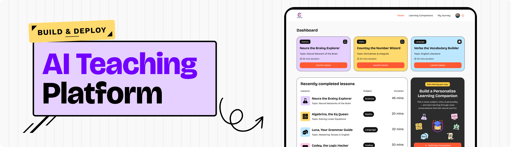

# 🚀 Converso - Real-time AI Teaching Platform

[](https://github.com/Amr-Elshabrawy-Dev/saas-app) [](https://nextjs.org/) [](https://reactjs.org/)

Converso is an innovative real-time AI teaching platform that connects learners with personalized AI companions for interactive educational experiences. Choose from various subjects and embark on engaging lessons powered by advanced AI technology, including voice and video capabilities.

## ✨ Features

- 🤖 **AI Companions**: Interactive AI tutors for different subjects (Math, Science, History, etc.).
- 🎯 **Personalized Learning**: Tailored lessons based on user preferences and progress.
- 📹 **Real-time Sessions**: Voice and video-powered teaching experiences using Vapi AI.
- 🔖 **Bookmark System**: Save favorite companions for quick access.
- 📊 **Session Tracking**: Monitor recent completed lessons and progress.
- 🎨 **Modern UI**: Beautiful, responsive design with Tailwind CSS.
- 🔐 **Secure Authentication**: Seamless user management with Clerk.
- ☁️ **Cloud Database**: Powered by Supabase for reliable data storage.
- 🚨 **Error Monitoring**: Sentry integration for smooth performance tracking.
- 📝 **Custom Companions**: Users can create their own AI companions with custom subjects, topics, voices, and styles.
- 🔍 **Search and Filter**: Easily find companions by subject or topic.

## 📺 Live Preview

<div align="center">
  <a href="https://companions-saas-app-i7sx.vercel.app/" target="_blank" rel="noopener noreferrer">
    
  </a>
  <p>
    <a href="https://companions-saas-app-i7sx.vercel.app/" target="_blank" rel="noopener noreferrer">View Live Demo</a>
  </p>
</div>

## 🛠️ Tech Stack

- **Framework**: [Next.js 15.5.0](https://nextjs.org/) - React-based full-stack framework
- **Frontend**: [React 19.1.0](https://reactjs.org/) - Modern React with hooks
- **Styling**: [Tailwind CSS v4](https://tailwindcss.com/) - Utility-first CSS framework
- **Database**: [Supabase](https://supabase.com/) - Open source Firebase alternative
- **Authentication**: [Clerk](https://clerk.com/) - Complete user management solution
- **Voice/Video AI**: [Vapi AI](https://vapi.ai/) - Real-time communication SDK
- **Monitoring**: [Sentry](https://sentry.io/) - Error tracking and performance monitoring
- **Forms**: React Hook Form with Zod validation
- **UI Components**: Radix UI for accessible, unstyled components
- **Icons**: Lucide React for beautiful, consistent iconography
- **TypeScript**: Full type safety throughout the application

## 📂 Project Structure

```txt
amr-saas-app/
├── app/                     # Next.js App Router pages and API routes
│   ├── api/                 # API routes
│   ├── companions/          # Companion-related pages
│   └── ...
├── components/              # Reusable React components
│   ├── ui/                  # UI components (buttons, forms, etc.)
│   └── ...
├── constants/               # Constant values and configurations
├── lib/                     # Library functions and utilities
│   ├── actions/             # Server-side actions
│   └── ...
├── public/                  # Static assets (images, fonts, etc.)
├── types/                   # TypeScript type definitions
└── ...                      # Configuration files
```

## 📥 Installation & Usage

### Prerequisites

- Node.js (version 18 or higher)
- npm or yarn

### Setup

1. **Clone the repository**

   ```bash
   git clone https://github.com/Amr-Elshabrawy-Dev/companions-saas-app.git
   cd saas-app
   ```

2. **Install dependencies**

   ```bash
   npm install
   ```

3. **Environment Setup**
   Create a `.env.local` file and configure the following:

   ```env
   NEXT_PUBLIC_CLERK_PUBLISHABLE_KEY=your_clerk_publishable_key
   CLERK_SECRET_KEY=your_clerk_secret_key
   NEXT_PUBLIC_SUPABASE_URL=your_supabase_url
   NEXT_PUBLIC_SUPABASE_ANON_KEY=your_supabase_anon_key
   SENTRY_AUTH_TOKEN=your_sentry_auth_token
   NEXT_PUBLIC_SENTRY_DSN=your_sentry_dsn
   ```

4. **Run in development mode**

   ```bash
   npm run dev
   ```

5. **Open [http://localhost:3000](http://localhost:3000) in your browser**

### Building for Production

```bash
npm run build
npm run start
```

## 📜 Scripts

- `npm run dev` → Starts the development server with Turbopack for fast reloads
- `npm run build` → Builds the application for production with Turbopack optimization
- `npm run start` → Runs the production build
- `npm run lint` → Runs ESLint to check code quality and style

## 🤝 Contribution

We welcome contributions! Here's how you can help make Converso even better:

1. Fork the repository
2. Create a feature branch: `git checkout -b feature/amazing-feature`
3. Make your changes and test thoroughly
4. Commit your changes: `git commit -m 'Add amazing feature'`
5. Push to the branch: `git push origin feature/amazing-feature`
6. Open a Pull Request

For major changes, please open an issue first to discuss what you'd like to change.

## 📑 License

This project is licensed under the MIT License - see the [LICENSE](LICENSE) file for details.

---

## 🌐 Let's Connect

<div align="center">

[](https://github.com/Amr-Elshabrawy-Dev) [](https://wa.me/201202546653?text=Hi%20Amr!%20I%20saw%20your%20portfolio%20and%20would%20love%20to%20discuss%20a%20potential%20collaboration) [](https://github.com/Amr-Elshabrawy-Dev) [](https://www.linkedin.com/in/amr-elshabrawy-dev) [](mailto:amrelshabrawy.dev@gmail.com) [](https://www.x.com/@AmrElshabr43803)

</div>

---

<div align="center">
    
    <br/><br/>
    <p align="center">
        Created with 💚 and ☕ by <strong><a href="https://github.com/Amr-Elshabrawy-Dev" target="_blank" rel="noopener noreferrer">AMR ELSHABRAWY</a></strong><br>
        &copy; 2025 | All Rights Reserved | Keep coding 🚀
    </p>
</div>
